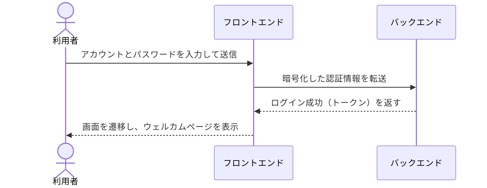

<span id="diagram-text" />

<!--renderComp=DocMultiLang-->
## {en: "Text Diagram", jp: "テキスト図表"}

<!--renderComp=DocMultiLang,type=paragraphs,languages=[en,jp]-->
```markdown
`DocDiagramText` displays text diagrams that remain readable in plain Markdown, with the box-drawing lines aligned in the browser. Full-width characters such as Japanese occupy 2 cells while alphanumeric characters and box-drawing lines occupy 1 cell, so the borders stay aligned even when font fallbacks are mixed.

`DocDiagramText` は、Markdown だけでも読めるテキスト図を、ブラウザー上で罫線が揃うように表示します。日本語などの全角文字を 2 セル、英数字と罫線を 1 セルとして配置するため、フォントのフォールバックが混在しても境界線がずれません。
```

<!--renderComp=DocMultiLang-->
### {en: "Syntax", jp: "構文"}

````markdown
<!--renderComp=DocDiagramText-->
```text
┌──────────────────────────────────────────────┐
│ 操作ツールバー                               │
├──────────────────────┬───────────────────────┤
│ ファイル一覧         │ 検索結果一覧          │
├──────────────────────┴───────────────────────┤
│ 選択カテゴリのファイル一覧                   │
└──────────────────────────────────────────────┘
```
````

<!--renderComp=DocMultiLang-->
### {en: "Display example", jp: "表示例"}

<!-- AI agent should not remove the text diagram below-->
<!--renderComp=DocDiagramText-->
```text
┌──────────────────────────────────────────────┐
│ 操作ツールバー                               │
├──────────────────────┬───────────────────────┤
│ ファイル一覧         │ 検索結果一覧          │
├──────────────────────┴───────────────────────┤
│ 選択カテゴリのファイル一覧                   │
└──────────────────────────────────────────────┘
```

<!--renderComp=DocMultiLang-->
### {en: "Authoring and maintenance", jp: "作成と保守"}

<!--renderComp=DocMultiLang,type=list,languages=[en,jp]-->
```markdown
- Place `<!--renderComp=DocDiagramText-->` directly before a `text` code block. Since plain Markdown shows it as a code block, the content stays readable outside the dedicated page.
- `<!--renderComp=DocDiagramText-->` を `text` コードブロックの直前に置きます。通常の Markdown ではコードブロックとして読めるため、専用画面以外でも内容を確認できます。
- Use the horizontal border lines as the reference for the outer frame and the positions of `┬` and `┴`. The component automatically adjusts the vertical borders of adjacent lines to those positions.
- 横罫線の行を基準に、外枠と `┬`／`┴` の位置を決めます。コンポーネントは、その位置へ隣接行の縦罫線を自動調整します。
- The number of Japanese characters and the number of display columns are not the same. When counting spaces by hand, treat a full-width character as 2 columns, and a half-width character or box-drawing line as 1 column.
- 日本語の文字数と表示列数は同じではありません。空白を手で数える時は、全角文字を 2 列、半角文字と罫線を 1 列として扱います。
- Use spaces, not tabs. Keep labels within their cell width, and update the horizontal borders above and below together after adding cells or changing widths.
- タブではなく空白を使います。ラベルが区画幅を超えないようにし、区画の追加や幅変更後は上下の横罫線も一緒に更新します。
- The automatic adjustment only grows or shrinks the spaces directly before a vertical border. It never truncates or wraps characters, so widen the diagram when content is long.
- 自動調整は縦罫線の直前にある空白だけを増減します。文字を切り詰めたり折り返したりしないため、内容が長い場合は図の横幅を広げます。
```

<span id="diagram-mermaid" />

<!--renderComp=DocMultiLang-->
## {en: "Mermaid Diagram", jp: "Mermaid 図表"}

<!--renderComp=DocMultiLang-->
### {en: "Sequence diagram", jp: "シーケンス図"}

<!--renderComp=DocMultiLang,type=paragraphs,languages=[en,jp]-->
```markdown
A sequence diagram shows in which order processing is handed over between the user, the frontend, and the backend.

利用者、フロントエンド、バックエンドの間で、処理がどの順番で受け渡されるかを表します。
```

<!--renderComp=DocMultiLang-->
#### {en: "Syntax", jp: "構文"}

````markdown
<!--renderComp=DocDiagramMermaid,title=ログイン処理のシーケンス図,displayMode=contain-->

````

<!--renderComp=DocMultiLang-->
#### {en: "Display example", jp: "表示例"}

<!--renderComp=DocDiagramMermaid,title=ログイン処理のシーケンス図,displayMode=contain-->

